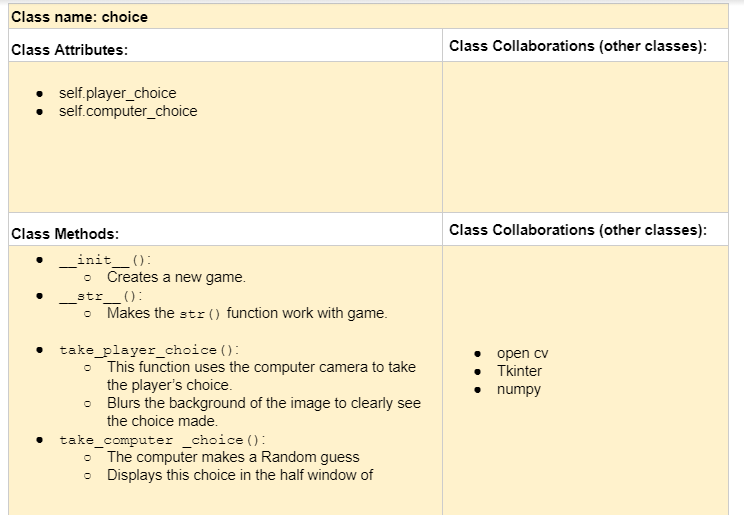
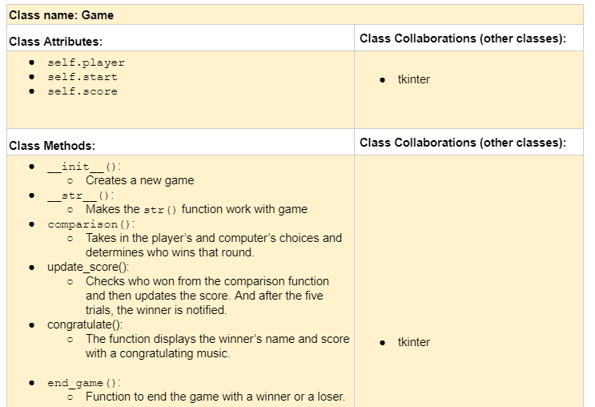

# P01: My 226 Final Project

**Term**: Fall 2019

**Author(s)**: Concepta Njolima

**Section**: A 

**References**: 
1. https://www.wrpsa.com/rock-paper-scissors-tournaments/
2. https://opencv.org/
3. https://www.youtube.com/watch?v=TGQcDaZ56ao
4. https://likegeeks.com/python-image-processing/#Reduce-Noise
5. https://stackoverflow.com/questions/34588464/python-how-to-capture-image-from-webcam-on-click-using-opencvhttps://stackoverflow.com/questions/34588464/python-how-to-capture-image-from-webcam-on-click-using-opencv
6. https://opencv-python-tutroals.readthedocs.io/en/latest/py_tutorials/py_video/py_bg_subtraction/py_bg_subtraction.html
7. https://github.com/opencv/opencv/tree/master/data/haarcascades
8. Background Image:https://www.google.com/url?sa=i&source=images&cd=&ved=2ahUKEwjJmq74l5bmAhULcq0KHeQrADgQjRx6BAgBEAQ&url=https%3A%2F%2Fcommons.wikimedia.org%2Fwiki%2FFile%3APierre_ciseaux_feuille_l%25C3%25A9zard_spock.svg&psig=AOvVaw07oHHk7IG3gj6CatEjDXi8&ust=1575349377113707
9. https://becominghuman.ai/real-time-finger-detection-1e18fea0d1d4
---

## Milestone 1: Setup, Planning, Design
*Due Friday, 11/15, by the **start of class**.*

**Project Title**: Rock, Paper, Lizard, Spock, Scissors

**Purpose**: The program will enable a user to play Rock,Paper,Lizard,Spock, and Scissors against a computer. The user's choice will be from the camera  
**Sources**: A07-Rock, Paper, Scissor
             A10-PPM

**Completed CRC card for the classes you will implement**:

---

## Milestone 2: Code
*Due Friday, 11/22, by the start of class.*

No README action items. Focus on your code! 🙃

---

## Milestone 3: Virtual Check-in
*Due Friday, 11/29, by 11:55PM*

**NOTE: This is due the Friday after Thanksgiving, when you're on break. Don't forget about it! You can do it before you leave on Wednesday!**

Add a note to this section that indicates what percentage of the project you have left to complete. 

**Completion Percentage**: 20%

---

## Milestone 4: Final Code, Presentation, Demo

*Due at the start of your section's Final Exam period.*

### User Instructions

Hit the start game button, then your web cam is launched. Using your fingers, choose an option that corresponds to rock, paper, scissors, lizard, or spock. The representations of these options are accessed when tou hit the "How to play" button on the first screen. After making a choice, click letter "s on the keyboard to save the choice. Then the player and computer boards will updated with the choices made and the scores. The player and computer play for five rounds before the winner  of the game is announced.   
 
### Errors and Constraints
- The in accuracy in finger detection especially for more than four fingers.
- There is a Tcl Tkinter error that persists in the console as the program runs

### Reflection

When we had Rock, Paper, Scissors as a homework assignment, I thought about how a player's choice could be made with out typing in the choice or clicking a button. Well, I was not sure if using a web cam for an input in python ever existed, but I thought that would be a great option. And when our final project assignments were released, I was sure I wanted to explore how I would be able to achieve the use of a web cam to play rock, paper, scissors, spock,lizard. This was the motivation for me to choose this project.
  
I am glad that my project is exactly how I imaged my initial design. Although when coding, I thought I could not achieve certain tasks and I had changed my approach. But with research, I was able to implement what I exactly envisioned in my design. This was supported by the resources available in the field of image processing with python.
   
The hardest part of this project was the image processing part because I had to learn how to use Opencv library. This took most of the time during the project. However, I knew that it was the unique part of my project, so it was worth the time investment. Also, having the choices and scores updated was a hard part of the assignment.
   
What I would do differently next time is to add comments to my code as I write the different parts of the code. In this project, I  wrote the entire program first ensuring it worked perfectly before documenting the code. After, all the parts of the code worked well, I was discouraged to go through over 400 lines of code and document them. So, next time, I will document my code step by step.
   

